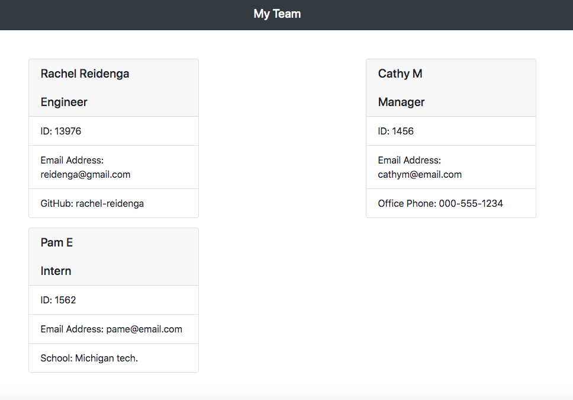
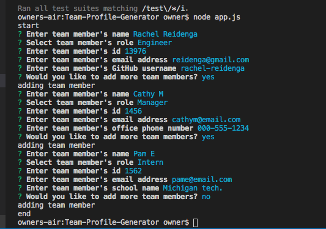
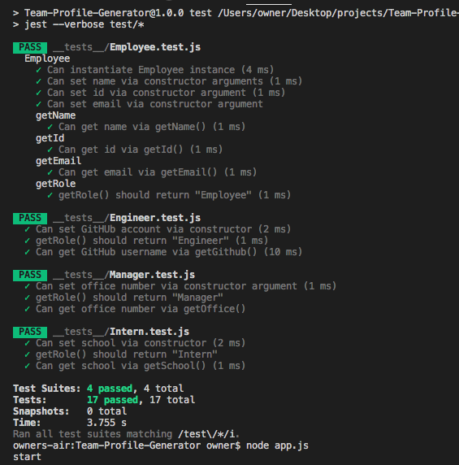

# Team-Profile-Generator

## Description
This app is a Node.js command-line application that takes in information about employees on a software engineering team and generates an HTML webpage that displays summaries for each person. The application uses both Jest for running the unit tests and Inquirer for collecting input from the user. The application will be invoked by using the following command: index.js.

## Table of Contents
* [Usage](#usage)

* [Credits](#contributing)

* [Questions](#questions)

## Images

## Technologies

* Node.js
* Inquirer
* Jest
* fs

## Usage
A user can quickly generate a team profile with multiple employees includding managers, engineers and interns. The application is clean and simple keeping all the information organized.

## Deployment

Link to [Video]()

Link to repo on [GitHub](https://github.com/Rachel-Reidenga/Team-Profile-Generator/)

### Contributing

[w3schools.com](https://www.w3schools.com/)

[stackoverflow](https://stackoverflow.com/)

[inquirer-npm](https://www.npmjs.com/package/inquirer.com/)

[jest](https://www.npmjs.com/package/jest/)

Shout out to Tanetta J, Monica H and Paul C

### Questions
If there are any questions please contact me  